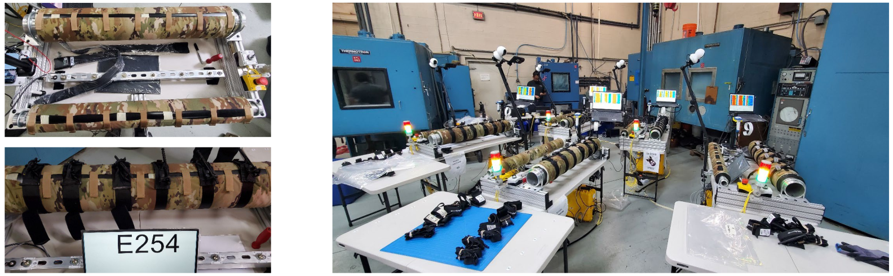
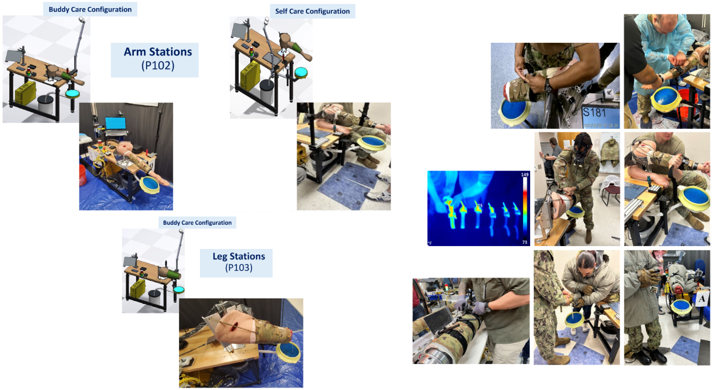
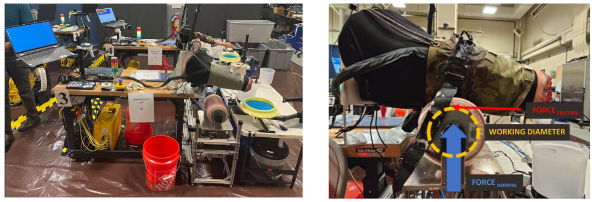

# 

I don’t just build models; I engineer systems that work in the real world. My expertise covers the full project lifecycle—from ideation and requirements development to material science and manufacturing process selection. I am not a hands-off theorist. I am a hands-on engineer who understands that a perfect CAD model is only the beginning. Below is a selection of projects—ranging from precision robotics to massive steel structures—that demonstrate my commitment to engineering excellence and practical, physical results.

## Mechanical System Design - Tourniquet Environmental and Performance Testing

This project focused on the performance and use of different tourniquets in different environments. This was a multiyear project that entailed system / mechanical / electrical / design of experiment / logistic / project management / fabrication effort working on a team. While my major responsibility was mechanical design, I also had a significant hand in the other areas and had the opportunity to work with a GREAT team. The information below and the results of this testing was presented at the Military Health System Research Symposium, (MHSRS).

Custom designed tourniquest test stands in use for environmental testing.

&nbsp;

Custom designed tourniquest test stands in CAD and shown in use operational testing by military personnel.

&nbsp;

Custom designed tourniquest test stands used for drag testing.

&nbsp;

## CAD Modeling Exercise - Patent 17,531 Wrench

As a personal exercise I imported a pdf of patent 17,531 invented by Edward J. Worcester, dated June 9, 1857 from https://patents.google.com/patent/US17531A/en?oq=17531, scaled the image based on an overall length of 8" and then created the parts, assembly and animation in SolidWorks.

## Industrial Systems Design & Structural Analysis

Led the end-to-end technical development for the Holcim facility upgrades, including P&ID, equipment sizing, and comprehensive structural design. I performed all primary structural analyses and load calculations, subsequently developing the corresponding detailed fabrication drawings in AutoCAD. All designs and calculations were formally reviewed and approved by a Licensed Professional Engineer (PE) prior to installation. I remained onsite to serve as the lead technical liaison, ensuring that field execution strictly adhered to the approved engineering specifications.

Aerial image from Google Earth of the various structures within my project scope (non blurred portion).

&nbsp;

Image compares the AutoCAD drawing of the structure on the left to a photo of the actual completed structure on the right. This structure is located in the far left of the aerial image.
