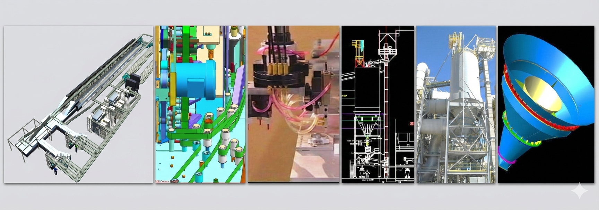
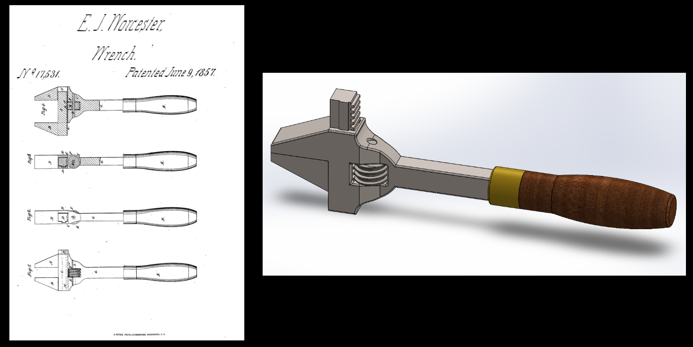
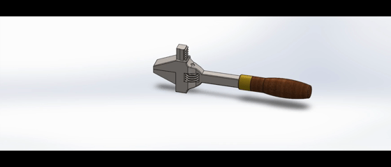
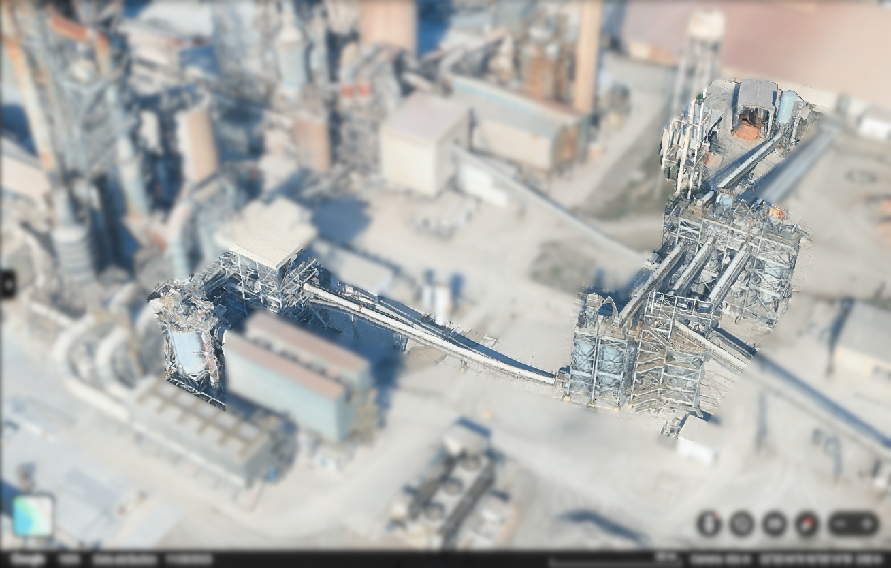
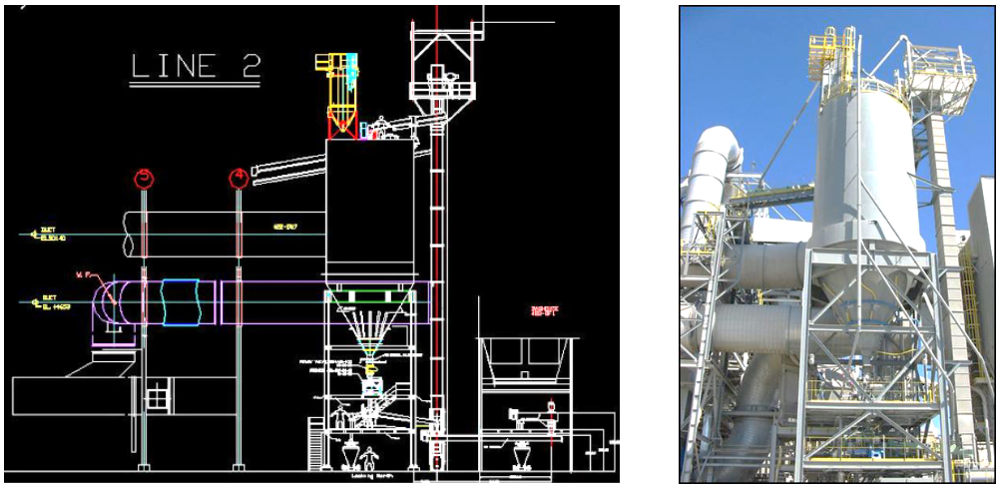

# 

I don’t just build models; I engineer systems that work in the real world. My expertise covers the full project lifecycle—from ideation and requirements development to material science and manufacturing process selection. I am not a hands-off theorist. I am a hands-on engineer who understands that a perfect CAD model is only the beginning. Below is a selection of projects—ranging from precision robotics to massive steel structures—that demonstrate my commitment to engineering excellence and practical, physical results.

## CAD Modeling Exercise - Patent 17,531 Wrench

Imported a pdf of patent 17,531 invented by Edward J. Worcester, dated June 9, 1857 from https://patents.google.com/patent/US17531A/en?oq=17531, scaled the image based on an overall length of 8" and then created the parts, assembly and animation in SolidWorks.

## Industrial Systems Design & Structural Analysis

Led the end-to-end technical development for the Holcim facility upgrades, including P&ID, equipment sizing, and comprehensive structural design. I performed all primary structural analyses and load calculations, subsequently developing the corresponding detailed fabrication drawings in AutoCAD. All designs and calculations were formally reviewed and approved by a Licensed Professional Engineer (PE) prior to installation. I remained onsite to serve as the lead technical liaison, ensuring that field execution strictly adhered to the approved engineering specifications.

Aerial image from Google Earth of the various structures within my project scope.

Image compares the AutoCAD drawing of the structure on the left to a photo of the actual completed structure on the right. This structure is located in the far left of the aerial image.
